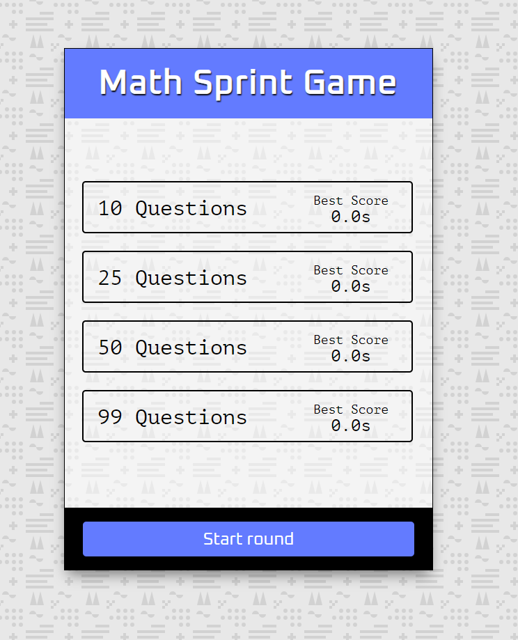

[math-sprint-game]: https://amssdias.github.io/math-sprint-game/

# Math Sprint Game

    

Math Sprint Game is a fun and challenging game designed to test and improve your math skills. The game features four levels of increasing difficulty, with a varying number of questions. For each incorrect answer, a penalty of 0.5 seconds is added to your score.

## Features
- **Local Storage**: Saves the scores in the browser's local storage, so you can track your progress over time.
- **Random Equations**: Ensures a unique experience each time you play with randomly generated equations.
- **Multiple Levels**: Four levels with different question counts:
  - Level 1: 10 questions
  - Level 2: 25 questions
  - Level 3: 50 questions
  - Level 4: 99 questions
- **Penalty for Incorrect Answers**: Adds a 0.5-second penalty for each incorrect answer, increasing the challenge.

## Live Demo

You can see the website in your browser by following this link: [Math Sprint Game][math-sprint-game]

